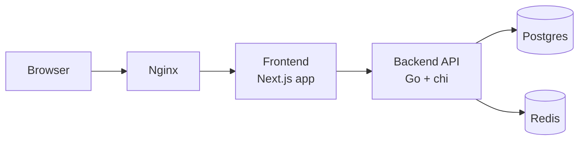

# Architecture

## Overview
This template solves the recurring setup burden of starting a production-grade web stack from scratch. It provides a pre-wired backend, frontend, contract checks, and deployment scaffolding so teams can focus on business features instead of bootstrapping infrastructure.

It is designed for:
- Full-stack Go + TypeScript teams
- API-first projects that need OpenAPI contract discipline
- Teams that want CI-enforced quality gates and reproducible local test environments

## System Architecture

Component roles:
- Browser: renders UI, calls frontend routes and API endpoints.
- Nginx: reverse proxy and edge layer for frontend/backend routing in deployed environments.
- Frontend (Next.js): App Router UI, metadata/SEO generation, API client consumption.
- Backend (Go/chi): HTTP routing, middleware enforcement, auth, DB/cache interaction.
- Postgres: system-of-record relational data store.
- Redis: low-latency key/value store for transient state such as counters and session-oriented cache.

## Backend Architecture
Package responsibilities:
- `backend/main.go`: process wiring, config bootstrap, middleware setup, server start.
- `backend/cmd/`: HTTP server runtime setup.
- `backend/internal/config/`: env-driven configuration loading.
- `backend/internal/router/`: route registration and handlers.
- `backend/internal/router/healthcheck/`: health/readiness endpoints.
- `backend/internal/auth/`: JWT token generation and validation.
- `backend/internal/database/`: GORM/Postgres connection lifecycle.
- `backend/internal/cache/`: Redis connection lifecycle.
- `backend/internal/models/`: persistence models shared with GORM.
- `backend/internal/swagger/`: embedded OpenAPI spec serving.
- `backend/internal/testutil/`: test DB/Redis setup helpers.
- `backend/internal/contract/`: OpenAPI/router contract tests.
- `backend/middleware/`: reusable request middleware (security, auth, validation, etc).
- `backend/migrations/`: production SQL migrations.

Request lifecycle:
1. Incoming request reaches chi router.
2. Middleware chain executes.
3. Route matching dispatches to handler.
4. Handler uses DB/cache/services as needed.
5. Handler writes JSON/YAML response.

Middleware order and rationale:
1. `security_headers`: set defensive headers on every response as early as possible.
2. `request_id`: assign/propagate request correlation ID for observability.
3. `rate_limit`: reject abusive traffic before expensive business logic.
4. `auth`: authenticate/authorize after basic request shaping and before protected logic.

This order ensures response hardening, traceability, load protection, and access control happen predictably.

Auth flow:
- `GenerateToken` in `internal/auth/token.go` signs JWTs (current implementation: HS256 via `JWT_SECRET`).
- `ValidateToken` verifies signature, expiry, and required claims (`sub`, `role`).
- Refresh flow issues short-lived replacement tokens (see `internal/router/auth.go` refresh handler pattern).

GORM models and migrations:
- Test setup uses GORM `AutoMigrate` in `internal/testutil/SetupTestDB` for rapid schema alignment.
- Production schema changes are tracked in `backend/migrations/*.sql` for explicit, reviewable DDL.
- Model structs (`internal/models`) must stay aligned with SQL migrations and OpenAPI response shapes.

## Frontend Architecture
App Router structure:
- `frontend/src/app/layout.tsx`: root layout, shared document/body shell, analytics script injection.
- `frontend/src/app/page.tsx`: default landing page.
- `frontend/src/app/sitemap.ts`: generates sitemap metadata route.
- `frontend/src/app/robots.ts`: generates robots metadata route.

API client layer:
- `frontend/src/lib/api-client.ts` wraps `fetch` with:
  - base URL support via `NEXT_PUBLIC_API_URL`
  - bearer token propagation from localStorage
  - 401 token cleanup
  - normalized API/network error handling (`ApiError`)
  - support for JSON and non-JSON success bodies

MSW mock layer:
- `frontend/src/mocks/handlers.ts` defines HTTP handlers that mirror OpenAPI routes.
- `frontend/src/mocks/server.ts` mounts handlers for tests.
- Active in test runtime only (Vitest + jsdom), not in production builds.

SEO utilities:
- `frontend/src/lib/seo.ts` builds metadata used by `layout.tsx`.
- `frontend/src/lib/sitemap.ts` builds sitemap entries.
- `src/app/sitemap.ts` and `src/app/robots.ts` convert lib output into App Router metadata routes.

## Data Layer
Postgres:
- Stores durable relational data (for example, user records in `internal/models/user.go`).
- Accessed via GORM through `internal/database/postgres.go`.
- Connection setup includes ping validation and pooled `sql.DB` reuse.

Redis:
- Stores ephemeral/shared state for API workflows (for example, rate limiting counters and session/token cache patterns).
- Connected through `internal/cache/redis.go` with startup ping checks.

Migration strategy:
- Tests: GORM `AutoMigrate` in test utility setup for fast isolated test initialization.
- Production: raw SQL migrations in `backend/migrations/` for controlled, auditable schema evolution.

## Security Model
Middleware layers and enforcement:
- `security_headers`: sets CSP, X-Frame-Options, X-Content-Type-Options, Referrer-Policy, Permissions-Policy, optional HSTS.
- `recover`: prevents panics from crashing request workers and returns controlled 500 responses.
- `cors`: allows only explicitly configured origins.
- `request_id`: injects `X-Request-ID` for trace correlation.
- `rate_limit`: enforces per-client request limits.
- `auth`: validates bearer JWT and injects auth context.
- `validate`: enforces JSON shape/constraints before handler logic.

JWT strategy:
- Signing algorithm: HS256 in current implementation.
- Token expiry: short TTL access tokens.
- Refresh pattern: dedicated refresh endpoint handler path that validates existing token and issues replacement token.
- Operational expectation: rotate secrets and enforce refresh token lifecycle policy in production.

Validation vs sanitization:
- Validation checks data shape/rules (required fields, formats, bounds).
- Sanitization strips/normalizes unsafe content before persistence/output.
- See `docs/security/INPUT_HANDLING.md` for policy and examples.

CORS policy:
- Explicit allowlist based on configured origins.
- Preflight responses include allowed methods/headers only for approved origins.

Security headers and impact:
- `X-Content-Type-Options: nosniff`: blocks MIME sniffing.
- `X-Frame-Options: DENY`: mitigates clickjacking.
- `Content-Security-Policy`: reduces script/style injection impact.
- `Referrer-Policy`: limits referrer data leakage.
- `Permissions-Policy`: disables unnecessary browser capabilities by default.
- `Strict-Transport-Security` (HTTPS): enforces TLS for repeat visits.

## Testing Strategy
Test pyramid target:
- Unit: 70%
- Contract: 20%
- Integration: 10%

Test tiers and locations:
- Unit tests:
  - Backend: `backend/**/**/*_test.go`
  - Frontend: `frontend/src/lib/__tests__/`
- Contract tests:
  - Backend contract suite: `backend/internal/contract/contract_test.go`
  - Frontend MSW/OpenAPI alignment checks: `frontend/src/lib/__tests__/api.test.ts`, `api-client.test.ts`
- Integration tests:
  - `backend/internal/integration/` with `integration` build tag

Why real Postgres/Redis instead of mocks:
- Prevents dialect/protocol mismatches hidden by in-memory substitutes.
- Validates real connection handling, timeouts, and query behavior.
- Preserves production parity across all backend test tiers.

Contract tripwire model:
- `backend/internal/swagger/openapi.yaml` defines expected API contract.
- chi router handlers must expose behavior that satisfies the spec.
- `frontend/src/mocks/handlers.ts` must mirror the same contract for frontend tests.
- Any mismatch triggers contract/test failures before merge.

## Deployment
Ansible deployment overview:
- `roles/docker`: host/container runtime prerequisites.
- `roles/postgres`: Postgres provisioning/configuration.
- `roles/redis`: Redis provisioning/configuration.
- `roles/backend`: Go API deployment and service management.
- `roles/frontend`: Next.js frontend deployment.
- `roles/nginx`: reverse proxy and public ingress configuration.

Environment promotion:
- Local -> Staging -> Production via environment-specific `.env` values and inventory/playbook execution.
- Keep secret/material differences in env management, not hardcoded source changes.

CI deployment gates:
- Unit, contract, and security checks run on every push/PR.
- Integration checks gate mainline changes targeting production paths.
- Deployment should only occur from green CI states and after contract validation.
